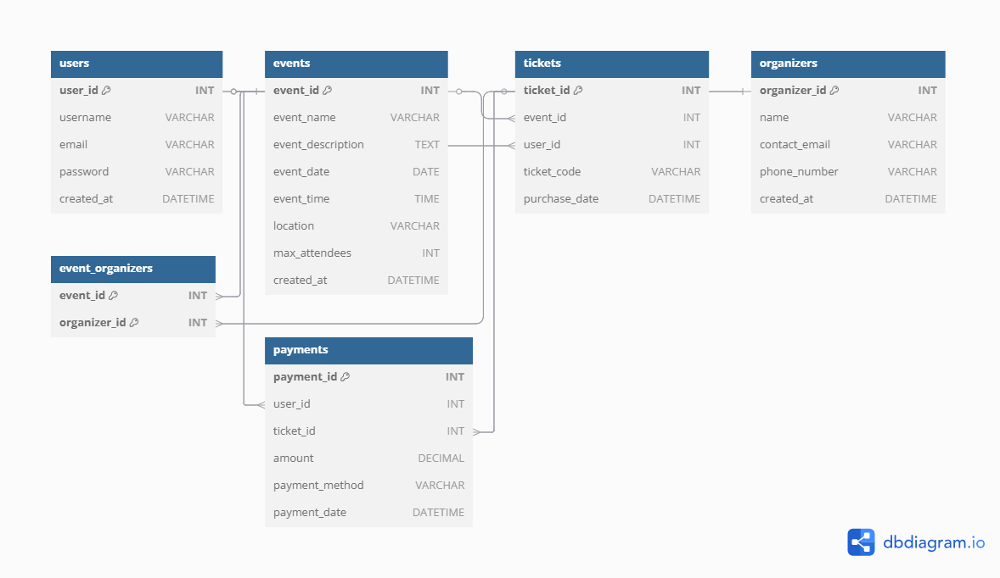

# 🎉 Event Management System

An interactive, full-featured database for managing events, attendees, and organizers. This project covers everything from user registrations to ticketing and payments, ensuring a seamless experience for event planners and participants.

## 🌟 Project Features

* User and organizer management
* Event creation and scheduling
* Ticket booking and tracking
* Secure payment processing
* Comprehensive relationship mapping

## 📁 Database Structure

The project uses a well-structured relational database, designed to efficiently handle the complex relationships typical of event management. Key tables include:

* **Users** - Manages attendee and organizer profiles
* **Events** - Stores event details
* **Tickets** - Handles ticket bookings
* **Organizers** - Manages event organizers
* **Event\_Organizers** - Links events to their organizers
* **Payments** - Tracks ticket payments

## 🚀 Getting Started

### Prerequisites

Ensure you have MySQL installed and running on your local machine or server.

### Importing the Database

1. Clone this repository or download the `.sql` file.
2. Open your MySQL client (e.g., phpMyAdmin, MySQL Workbench, or command line).
3. Create a new database:

   ```sql
   CREATE DATABASE event_management_system;
   USE event_management_system;
   ```
4. Import the `event_management_system.sql` file.
5. Verify the tables have been created:

   ```sql
   SHOW TABLES;
   ```

## 🖼️ Database ERD

Here is the Entity-Relationship Diagram (ERD) for the project:



## 🤝 Contributing

Pull requests are welcome. For major changes, please open an issue first to discuss what you would like to change.

## 📄 License

This project is licensed under the MIT License.

## 💬 Feedback

For any questions or feedback, please reach out or create an issue. Happy coding! 🚀
